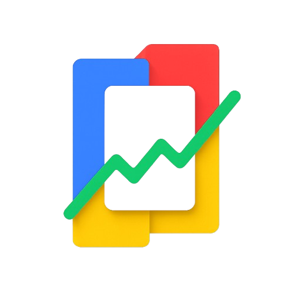
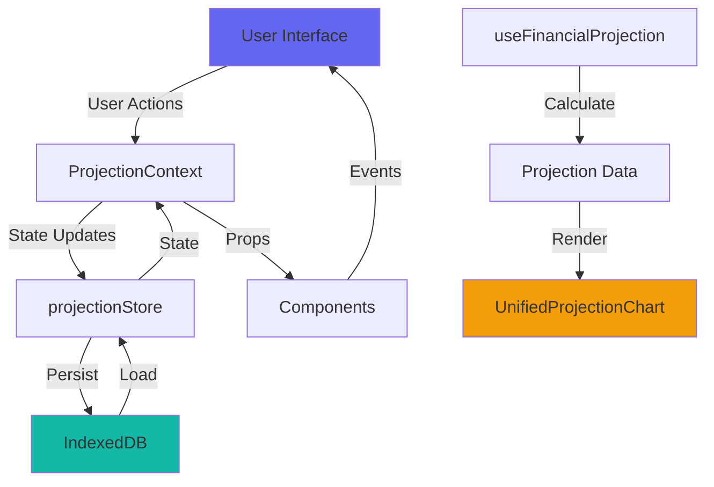
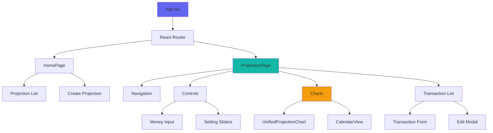
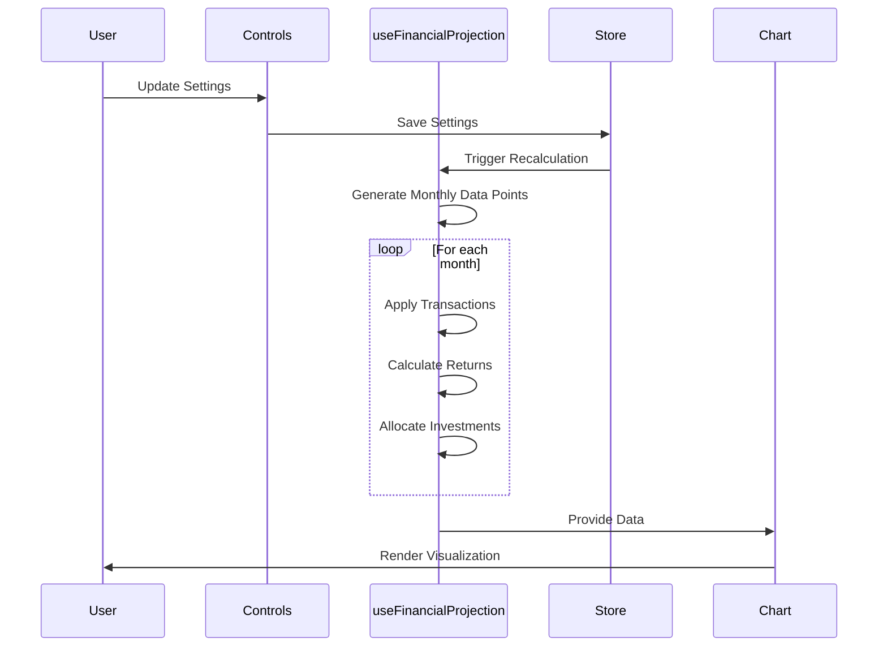

# 💰 FinAI - Financial Future Projection

<div align="center">
  
  
  **Plan your financial future with intelligent projections and scenario modeling**
  
  [](https://opensource.org/licenses/MIT)
  [](https://www.typescriptlang.org/)
  [](https://react.dev/)
</div>

---

## 🎯 Overview

FinAI is a powerful financial projection planning tool that helps you visualize and understand your financial future. Create multiple projection scenarios, manage complex income and expense streams, and make informed decisions about your investments and savings strategy.

### Key Features

- 📊 **Multi-Scenario Projections** - Create and compare unlimited financial scenarios
- 💸 **Transaction Management** - Define recurring income and expenses with flexible frequencies
- 📈 **Investment Modeling** - Model investment returns with customizable allocation strategies
- 🎨 **Interactive Visualizations** - Beautiful charts with consistent scaling and detailed breakdowns
- 🌍 **Multi-Language Support** - English, Spanish, and Portuguese
- 💾 **Offline-First** - All data stored locally using IndexedDB
- 🎭 **Dark Theme** - Modern, easy-on-the-eyes interface
- 📅 **Calendar View** - Visualize cash flows in calendar format

---

## 🛠️ Tech Stack

| Category | Technology |
|----------|------------|
| **Frontend** | React 19.2 + TypeScript 5.8 |
| **Styling** | Tailwind CSS 4.1 |
| **Charts** | Recharts 3.3 |
| **Routing** | React Router DOM 6.25 |
| **Storage** | IndexedDB (via idb 8.0) |
| **Build Tool** | Vite 6.2 |
| **Icons** | Lucide React |
| **Package Manager** | Yarn |

---

## 🚀 Getting Started

### Prerequisites

- **Node.js** 18.x or higher
- **Yarn** (preferred package manager)

### Installation

```bash
# Clone the repository
git clone https://github.com/yourusername/finai.git
cd finai

# Install dependencies
yarn install
```

### Development

```bash
# Start development server (http://localhost:3000)
yarn dev
```

### Production

```bash
# Build for production
yarn build

# Preview production build
yarn preview
```

---

## 📁 Project Structure

```
finai/
├── components/          # React components
│   ├── ui/             # Reusable UI components (Button, Input, Card, etc.)
│   ├── icons/          # Icon components
│   ├── Controls.tsx    # Projection settings controls
│   ├── UnifiedProjectionChart.tsx  # Main chart component
│   ├── TransactionList.tsx         # Transaction management
│   ├── ParticleBackground.tsx      # Animated background
│   └── ...
├── context/            # React context providers
│   ├── LanguageContext.tsx        # i18n support
│   └── ProjectionContext.tsx      # Projection state
├── hooks/              # Custom React hooks
│   ├── useFinancialProjection.ts  # Core projection logic
│   └── useProjections.ts          # Projection CRUD operations
├── store/              # State management
│   ├── projectionStore.ts         # Projection data store
│   ├── queryInterface.ts          # Read operations
│   └── mutationInterface.ts       # Write operations
├── pages/              # Route pages
│   ├── HomePage.tsx               # Dashboard
│   └── ProjectionPage.tsx         # Projection detail view
├── locales/            # i18n translations
│   ├── en.json
│   ├── es.json
│   └── pt.json
├── utils/              # Utility functions
│   ├── db.ts          # IndexedDB setup
│   └── colors.ts      # Color utilities
├── lib/                # Third-party integrations
│   └── utils.ts       # Tailwind merge utilities
└── types.ts           # TypeScript type definitions
```

---

## 🏗️ Architecture

### Data Flow



### Component Hierarchy



### Projection Calculation Flow



---

## 💡 How It Works

### Financial Projection Model

1. **Initial State**: Start with an initial balance
2. **Monthly Iteration**: For each month in the projection period:
   - Apply all active income transactions
   - Apply all active expense transactions
   - Calculate investment returns on invested balance
   - Allocate surplus according to investment allocation percentage
   - Track cash and invested balances separately

3. **Transaction Types**:
   - **Income**: Adds to cash flow (salary, passive income, etc.)
   - **Expense**: Subtracts from cash flow (rent, utilities, etc.)

4. **Frequencies**:
   - **Once**: Single occurrence on start date
   - **Monthly**: Repeats every month
   - **Yearly**: Repeats annually

5. **Investment Model**:
   - Monthly return rate applied to invested balance
   - Configurable allocation percentage (0-100%)
   - Compound growth over time

---

## 🎨 Features in Detail

### 📊 Unified Projection Chart

Interactive chart combining:
- **Wealth Projection**: Stacked area chart showing cash + invested assets
- **Cash Flow Breakdown**: Stacked bar chart showing all income/expense streams
- **Consistent Scaling**: Charts maintain same scale for easy comparison
- **Toggle Visibility**: Show/hide wealth or cash flow independently

### 🎯 Transaction Management

- Color-coded transactions for easy identification
- Enable/disable transactions without deleting
- Edit existing transactions with modal interface
- Duplicate transactions for quick scenario creation
- Start/end date support for time-bound transactions

### ⚙️ Projection Settings

- **Initial Balance**: Starting cash with thousands-separator formatting ($1,234,567)
- **Projection Years**: 1-50 years into the future
- **Monthly Return Rate**: 0-2% monthly investment returns
- **Investment Allocation**: 0-100% of surplus to invest vs hold as cash

### 🌐 Multi-Language

Seamlessly switch between:
- 🇺🇸 English
- 🇪🇸 Spanish
- 🇧🇷 Portuguese

### 🎭 Enhanced Animations

- **Particle Background**: Dynamic multi-color particles with:
  - Pulsing size animation
  - Color cycling through blues, teals, purples, golds
  - Glow effects
  - Interactive connections between particles

---

## 🤝 Contributing

Contributions are welcome! Please follow these steps:

1. Fork the repository
2. Create a feature branch (`git checkout -b feature/amazing-feature`)
3. Commit your changes (`git commit -m 'Add amazing feature'`)
4. Push to the branch (`git push origin feature/amazing-feature`)
5. Open a Pull Request

### Development Guidelines

- Use TypeScript strict mode (no `any`)
- Follow existing code style
- Write tests for new features (colocated `*.spec.ts`)
- Update documentation for significant changes

---

## 📄 License

This project is licensed under the **MIT License**.

```
MIT License

Copyright (c) 2025 FinAI Contributors

Permission is hereby granted, free of charge, to any person obtaining a copy
of this software and associated documentation files (the "Software"), to deal
in the Software without restriction, including without limitation the rights
to use, copy, modify, merge, publish, distribute, sublicense, and/or sell
copies of the Software, and to permit persons to whom the Software is
furnished to do so, subject to the following conditions:

The above copyright notice and this permission notice shall be included in all
copies or substantial portions of the Software.

THE SOFTWARE IS PROVIDED "AS IS", WITHOUT WARRANTY OF ANY KIND, EXPRESS OR
IMPLIED, INCLUDING BUT NOT LIMITED TO THE WARRANTIES OF MERCHANTABILITY,
FITNESS FOR A PARTICULAR PURPOSE AND NONINFRINGEMENT. IN NO EVENT SHALL THE
AUTHORS OR COPYRIGHT HOLDERS BE LIABLE FOR ANY CLAIM, DAMAGES OR OTHER
LIABILITY, WHETHER IN AN ACTION OF CONTRACT, TORT OR OTHERWISE, ARISING FROM,
OUT OF OR IN CONNECTION WITH THE SOFTWARE OR THE USE OR OTHER DEALINGS IN THE
SOFTWARE.
```

---

## 🗺️ Roadmap

### Planned Features

- [ ] **Export/Import**: JSON export for backup and sharing
- [ ] **PDF Reports**: Generate printable projection reports
- [ ] **Goal Tracking**: Set and track financial goals
- [ ] **Scenario Comparison**: Side-by-side comparison view
- [ ] **Tax Modeling**: Include tax calculations in projections
- [ ] **Inflation Adjustment**: Factor in inflation rates
- [ ] **Advanced Charts**: Additional visualization types
- [ ] **Mobile App**: React Native version
- [ ] **Cloud Sync**: Optional cloud backup (privacy-first)
- [ ] **AI Insights**: Intelligent recommendations based on projections

### Recent Improvements

- ✅ **Chart Scale Consistency**: Fixed domain calculation for comparable scales
- ✅ **Enhanced Particles**: Dynamic colors, sizes, and glow effects
- ✅ **Money Formatting**: Thousands separators in input fields
- ✅ **Comprehensive Docs**: This README with architecture diagrams

---

## 🙏 Acknowledgments

Built with modern web technologies and inspired by the need for accessible financial planning tools.

---

<div align="center">
  Made with ❤️ for better financial futures
  
  **[Report Bug](https://github.com/yourusername/finai/issues)** · **[Request Feature](https://github.com/yourusername/finai/issues)**
</div>
